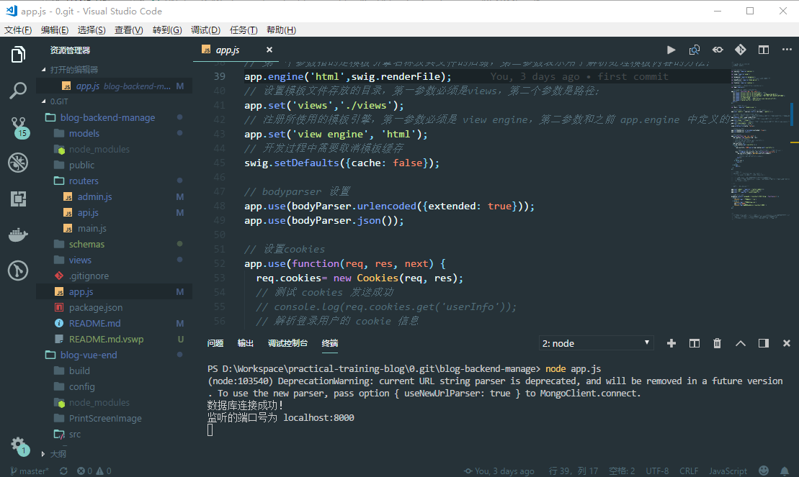

# 一、blog-service-19904（博客服务端项目，操作数据库，写数据接口）

> 利用 NodeJs 书写服务端程序，该项目包含 express框架、mongoose模块、body-parser模块、cookies模块；

### （一）、服务端项目设计需求

> 1. 连接 MongoDB 数据库，设计所需要的数据表结构，同时存储所有的博客网站数据，包括博文的数据以及评论的所有数据；

> 2. 设计并实现后台管理项目的数据接口，能够在后台管理项目上面对博文进行管理，进行增删改查的操作；

> 3. 设计并实现博客前端展示项目的数据接口，能够给前端展示页面项目提供所需要的数据接口，实现前端展示页面的动态加载；

### （二）、所用的知识点

> 1. 利用 NodeJs 书写服务端程序，该项目包含 express框架、mongoose模块、body-parser模块、cookies模块（**了解以上每一个模块的使用方法，来进行项目的搭建**）；

> 2. 利用 Chrome 插件 postman 对数据接口进行测试，能够通过 POST 或 GET 请求，得到正确的数据；

### （三）、目前项目实现的功能（后台管理系统的API接口已实现，前端展示页面的API接口还没有实现）小括号中的为API接口

> 1. 使用 NodeJs 书写服务端程序，该项目框架由 express 框架搭建，数据库操作由mongoose 模块支持，跨域 POST 请求发送的数据由 body-parser 模块支持；用户的登录信息保存功能由 cookies模块支持；

> 2. CORS（跨来源资源共享）能够让前端项目跨域连接到服务端，来获取服务端的相关数据，实现博文数据的动态获取或者写入；

> 3. 用户的注册（`api/user/register`）与登陆（`/api/user/login`）API接口；
*但是用户刷新界面后的登录数据会消失，这个还没有做好，可以使用token ，或者使用 cookies、session来实现登录状态保持；*

> 4. 用户管理界面API接口，管理员身份查看当前的所有注册用户（`/admin/user`）；

> 5. 文章分类界面API接口，能够查看当前的所有文章分类（/admin/category），也能够添加（`/admin/category/add`）、修改（`/admin/category/edit【get请求】`）修改后提交（`/admin/category/edit【post请求】`）、删除（`/admin/category/delete`）文章分类；

> 6. 博文管理界面API接口，能够查看当前的所有博文（/admin/content），也能够添加（`/admin/content/add`）、修改（`/admin/content/edit【get请求】`）、修改后提交（`/admin/content/edit【post请求】`）、删除（`/admin/content/delete`）博文；

> 7.其他站点设置界面的API接口，个人站点的数据获取（`/admin/admin/selfsite`）、个人站点的数据添加（`/admin/selfsite/add`）、个人站点的数据删除（`/admin/selfsite/delete`）

> 8. 当前登录用户API接口，实现退出当前用户的功能（`/api/user/logout`）；

### （四）、还没有实现的功能

> 1. 后台管理项目的关于博文的图片上传功能的API接口还没有实现；

> 2. 博客前端展示项目的API接口还没有实现；

# 二、blog-service-19904 下载安装运行

## （一）、Demo 演示地址（暂无）

## （二）、安装教程

### 注意：

> 该项目（服务端项目）需要配合服务器端项目以及 MongoDB 数据库一起运行，才能看到相关的效果，开启顺序是：

> 1. 先打开 MongoDB 数据库，运行数据库（bin 目录下进入cmd，输入 `mongo`）；

> 2. 再运行服务端程序（进入项目，输入 `node app.js`）

> 3. 最后运行后台管理项目，运行项目（项目目录下输入`npm run dev`）

> 4.目前由于上传的项目文件没有包含数据库相关的数据，因而打开的页面没有数据，可以自行通过添加数据查看展示效果，可以测试请求数据的接口能否获取服务端项目数据，检验项目正常运行。

#### 1.下载整个项目，运行下面的指令：

```bash
git clone https://rdc.hand-china.com/gitlab/practical-training/blog-service-19904.git
```

#### 2.进入该项目，然后进行第三方依赖的安装，安装完成后先将 MongoDB 数据库连接好，再运行整个项目：

```bash
cd blog-service-19904
# install dependencies
npm install
# serve with hot reload at localhost:8000
node app.js
```

#### 3.服务端项目运行的地址为 localhost:8000，前端项目的所有请求都必须通过该端口获取到服务端的数据；

#### 4.项目效果截图：

**1. 服务端项目成功运行截图**



